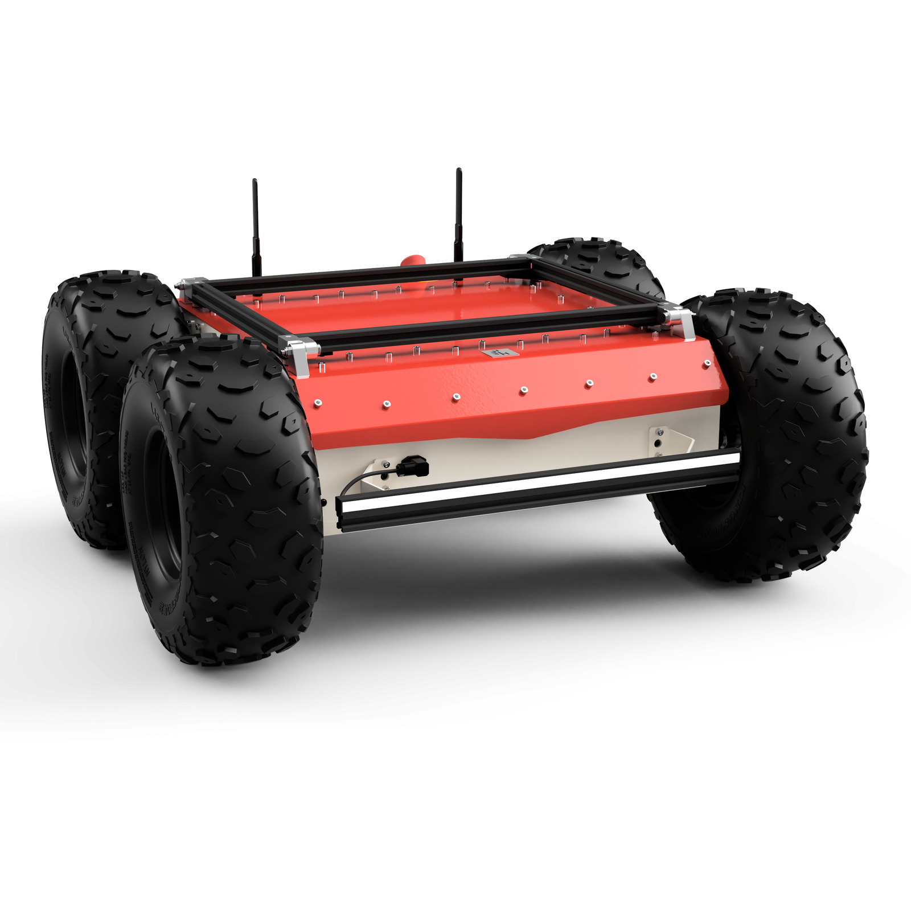

<!--
SPDX-FileCopyrightText: Alliander N. V.

SPDX-License-Identifier: Apache-2.0
-->

# RCDT Robotics

This repository is used for development of robotics in the Alliander Research Center for Digital Technologies (RCDT). Currently, RCDT has two robots we use for development:

|  |  |
| :---------------------: | :--------------------: |
|    Franka Research 3    |    Husarion Panther    |

## License

This project is licensed under the Apache License Version 2.0 - see [licence](../LICENSES/Apache-2.0.txt) for details.

## Contributing

Please read [CODE_OF_CONDUCT](CODE_OF_CONDUCT.md), [CONTRIBUTING](CONTRIBUTING.md), and [PROJECT GOVERNANCE](PROJECT_GOVERNANCE.md) for details on the process for submitting pull requests to us.
