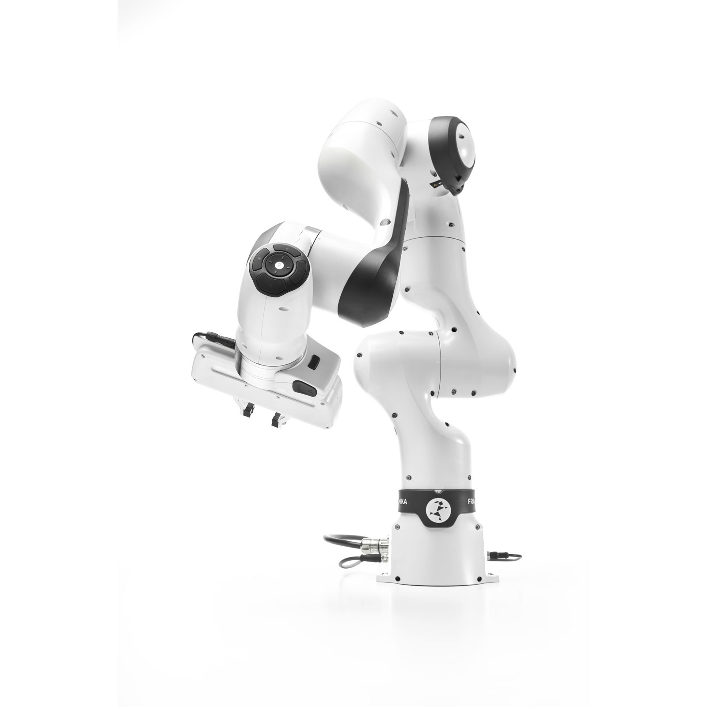

<!--
SPDX-FileCopyrightText: Alliander N. V.

SPDX-License-Identifier: Apache-2.0
-->

# RCDT Robotics

This repository shares all developments happening within the Alliander Robotics team. Projects include inspection robotics, gas leak detection, and operating robots under voltage. 

# Goals for sharing
Our goal for sharing this software is to encourage research on robotic implementations in the energy network to help with the energy transition. The software is not intended for production use.

|  |  |
| - | - |

## Robots

|  |  |
| :----------------------------: | :---------------------------: |
|       Franka Research 3        |       Husarion Panther        |

## License

This project is licensed under the Apache License Version 2.0 - see [licence](../LICENSES/Apache-2.0.txt) for details.

## Contributing

Please read [CODE_OF_CONDUCT](CODE_OF_CONDUCT.md), [CONTRIBUTING](CONTRIBUTING.md), [PROJECT GOVERNANCE](PROJECT_GOVERNANCE.md), and [SUPPORT](SUPPORT.md) for details on the process for submitting pull requests to us.
