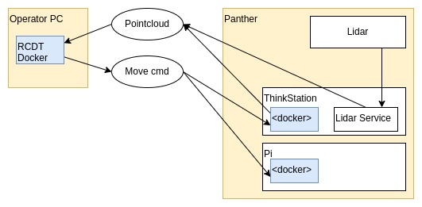
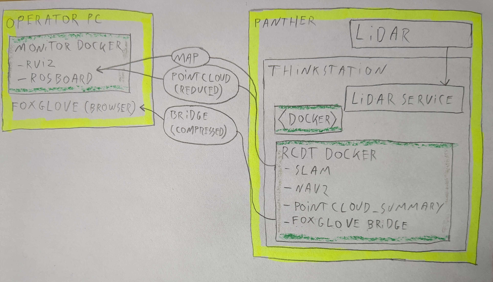

<!--
SPDX-FileCopyrightText: Alliander N. V.

SPDX-License-Identifier: Apache-2.0
-->

# Panther

This page gives information about usage of the Husarion Panther.

## Physical robot

### Quick start

The physical robot can  be started with the following steps:

- Enable the battery (switch at the front of the robot).
- Start the robot (press red power button).
- Wait till the [E_STOP animation](https://husarion.com/manuals/panther/software/ros2/robot-management/#led-animations) is played
- Release hardware stop (rotate red emergency button if it was pressed).
- Start the Logitech gamepad:
  - press Logitech button.
  - press *mode* button if mode light is on (should be off).
  - put the switch at the back on *D*.
- Remove the E_STOP by *Left Trigger + A* on the gamepad.
- You can drive by pressing *Left Button* and use the two joysticks.
- You can enable the E_STOP by pressing *B*.
- See [this](https://husarion.com/manuals/panther/software/ros2/robot-management/#gamepad) for more information about gamepad control.

The robot can be shut down as follows:

- Shut down the robot (hold red button next to battery switch till it starts blinking).
- Wait until all lights are off.
- Disable the battery (switch at the front of the robot)

### Configuration

When the Panther is started, two WiFi networks (*Panther_<serial_number>* and *Panther_5G_<serial_number>*) should be available. One can connect with one of the WiFi networks or connect using a ethernet cable directly to the Teltonika (this may require to remove one of the other ethernet cables, like the one of the lidar). After connecting, it should be possible to ssh into all three computers.

**Teltonika RUTX11:**
\
This is an industrial router. The *Raspberry Pi 4* and *Lenovo ThinkStation P360* are connected to the *Teltonika* by Ethernet. Also the *Velodyne Lidar* and is connected to the *Teltonika* by Ethernet. A [combo antenna](https://teltonika-networks.com/products/accessories/antenna-options/combo-mimo-mobilegnsswi-fi-roof-sma-antenna) (the black dome) is also connected, which enables the *Teltonika* to obtain a GPS location.

**Raspberry Pi 4 :**
\
The *Raspberry Pi 4* is built in the front of the Panther and not directly accessible. Two Docker images are pre-installed: a [docker image](https://hub.docker.com/r/husarion/panther) of the [panther_ros](https://github.com/husarion/panther_ros) repository and a [docker image](https://hub.docker.com/r/husarion/joy2twist) of the [joy_to_twist](https://github.com/husarion/joy2twist) repository. Both images are started automatically when the robot starts, as do all docker images installed on the Pi. The first image runs all the required software to use the robot, like motor control and led control. The second image enables gamepad control with the Logitech gamepad shipped with the robot, when the USB receiver is connected to the USB port at the front of the robot.

We have also cloned the [nmea-gps-docker](https://github.com/husarion/nmea-gps-docker/tree/ros2) repository with a docker that enables use of GPS in ROS. This docker images gets started automatically as well when the the Panther starts. For more information about the use of this docker, see the Sensors section.

**Lenovo ThinkStation P360**
\
The *Lenovo ThinkStation P360* is a powerful computer, used to handle the camera stream. The robot is shipped with a ZED 2i depth camera, which can be connected to the *ThinkStation* by USB-C. We have installed the required Nvidia software, based on our own [Docker installation](docker.md) to run dockers with use of the Nvidia CPU. Next, we cloned Husarion's [zed-docker](https://github.com/husarion/zed-docker), [realsense-docker](https://github.com/husarion/realsense-docker/tree/ros2) and [velodyne-docker](https://github.com/husarion/velodyne-docker/tree/ros2) to the *ThinkStation*. These docker images enable easy use of the *ZED* and *Realsense* camera's or *Velodyne* LiDAR. For more information about the use of these dockers, see the Sensors section.

### Sensors

The Husarion Panther is shipped with different sensors:

- ZED 2i depth camera
- Velodyne VLP 16 LiDAR
- GPS (using Teltonika RUTX 11)

For all sensors, Husarion provides docker images to easily start them connected with ROS.

**ZED 2i:**
\
To use the ZED 2i camera, ssh into the *ThinkStation*. Here you can find the cloned [zed-docker](https://github.com/husarion/zed-docker) repository folder. The docker can be started with these commands:

```bash
cd ~/zed-docker/demo;
xhost local:root;
export ZED_IMAGE=husarion/zed-desktop:humble;
export CAMERA_MODEL=zed2;
docker compose up zed;
```

We also created the script `~/zed` which executes these commands. Running the docker with the camera connected should start the ROS nodes that publish the camera stream on ROS topics.

**Realsense:**
\
Use of a Realsense is similar to the use of ZED camera. You can find the [realsense-docker](https://github.com/husarion/realsense-docker/tree/ros2) repository folder on the *ThinkStation* and start the docker:

```bash
cd ~/realsense-docker/demo;
xhost local:root;
docker compose up realsense;
```

We also created the script `~/realsense` which executes these commands. Running the docker with the camera connected should start the ROS nodes that publish the camera stream on ROS topics.

**Velodyne:**
\
To use the Velodyne LiDAR, we have to make sure that the *Velodyne* uses the *ThinkStation* as host. The settings of the *Velodyne* can be reached by it's ip-address, which can be found by a network scan:

```bash
nmap -sn 10.15.20.0/24
```

One of the devices in the network should be `che.lan` (which is the *Velodyne*). Now we can open the settings by going to this ip-address in a browser:


Here, we can set the host ip-address the ip-address of the *ThinkStation*. Next, you can find the [velodyne-docker](https://github.com/husarion/velodyne-docker/tree/ros2-fix-tf) repository folder on the *ThinkStation* and start the docker:

```bash
cd ~/velodyne-docker/demo;
docker compose up;
```

We also created the script `~/velodyne` which executes these commands. Note that the settings of this docker can be changed in the two files in the `~velodyne-docker/demo/config/` folder. Especially the *device_ip* parameter in the `panther_velodyne_driver.yaml` is important and needs to be the ip-adress of the *Velodyne*.

The topic `/panther/velodyne/velodyne_points` can be used to visualize the LiDAR data.

**GPS:**
\
To use the GPS in ROS, the `nmea-gps-docker` image is started automatically on the *Raspberry Pi*. This docker only works if the *Teltonika* forwards the GPS data to the *Raspberry Pi*. The corresponding settings can be adapted by accessing the the ip-address of the *Teltonika*. Default username is `admin` and default password is `Husarion1` and logging in should give you the settings:


Make sure that Hostname is set to the ip-address of the *Raspberry Pi*. The docker image should now publish the GPS location on the ROS  topic `panther/gps/fix`, if the location is available. Note that GPS might not work indoor. The GPS can also be tested in the *Teltonika* map page.

## Simulation

You can start a simulation of the Panther using the `rcdt_panther/rcdt_panther.launch.py` file. It can be started including a simulated Velodyne LiDAR by passing the `velodyne:=True` flag:

```bash
ros2 launch rcdt_panther panther.launch.py velodyne:=True
```

This should start the simulation with the following Rviz visualization:


You can control the simulated Panther if a gamepad is connected. By default, the E-STOP is triggered and you need to reset this before you can control the Panther:

```bash
ros2 service call /hardware/e_stop_reset std_srvs/srv/Trigger {}
```

## Slam, Collision Monitor and Navigation

It is possible to run the Panther with additional tools, both in simulation and on the real robot. When using the real robot, make sure to have your laptop connected to the Panther network (preferably by ethernet for the best results) and to pass the `simulation:=True` flag to each launch command mentioned in the next steps:

**Slam:**

```bash
ros2 launch rcdt_panther panther.launch.py slam:=True
```

A map should be visualized in Rviz and be updated when driving around.

**Collision Monitor:**

```bash
ros2 launch rcdt_panther panther.launch.py collision_monitor:=True
```

Next, start the collision monitor in a second terminal:

```bash
ros2 launch rcdt_panther collision_monitor.launch.py
```

Rviz should visualize "slow-down" regions around the Panther and the Panther should slow down when objects are in these regions.

**Navigation:**

```bash
ros2 launch rcdt_panther panther.launch.py nav2:=True
```

Next, start navigation in a second terminal:

```bash
ros2 launch rcdt_panther navigation.launch.py
```

Now you should be able to place a *2D Goal Pose* in Rviz, somewhere on the map. The robot should plan, visualize and drive a route to this goal pose.

:::{note}
Don't forget to reset the E-STOP when the Panther should drive:

```bash
ros2 service call /hardware/e_stop_reset std_srvs/srv/Trigger {}
```

:::

## Proposed changes to reduce network traffic

During experimentation it became clear that at least ethernet-speed connections are required in order to deal with pointcloud data without dropping messages. The current high-level architecture when using a LiDAR is as follows:  

 

A major advantage to this architecture is that it allows for fast and easy development, and straightforward inspection of any ROS topics using Rviz and/or ROSBoard. However, this makes it impossible to use wifi to operate the robot, making a cable mandatory. This provides obvious limitations for use-cases where further autonomy is required.  

One proposed alternate setup wold be to move the RCDT docker container to the onboard ThinkStation. This would eliminate the need to broadcast pointcloud data over the network, instead keeping it all within the robot itself.  

 

A downside to this approach, however, would be that live inspection of data generated by the robot becomes more complex. Lower-bandwith data such as a generated map or camera data would be no problem to consume using a simpler "monitor" docker container that only needs to run Rviz and/or ROSBoard.  

Additionally, the RCDT docker could be extended to run foxglove. One of the promising features of foxglove is that it supports 3D data visualizations in-browser, and [supports compression of topics](https://docs.foxglove.dev/docs/connecting-to-data/ros-foxglove-bridge). It appears this compression would be lossless, but this has not been explored in detail, yet. [A simple intro to foxglove with some basic examples is provided in this blogpost](https://foxglove.dev/blog/installing-ros2-on-macos-with-docker). It is also worth noting that foxglove requires certain ports to be exposed in the docker container, [similar to how is dicussed here](https://www.reddit.com/r/docker/comments/1aq8v9b/ports_in_docker_and_docker_compose/). Finally, foxglove also provides a level of [integration with ROSBoard](https://discourse.ros.org/t/introducing-foxglove-integration-with-rosboard-for-real-time-visualizations/38376) allowing for some reuse of the ROSBoard features we have already set up.  

Another approach could be to [create a (lossy) compressed topic](https://discourse.ros.org/t/compressed-pointcloud2/10616) for pointcloud data that would only serve inspection purposes; not SLAM/nav2 purposes. This would require further investigation into the current state of availability of these kinds of topics, though, since the thread linked here is a few years old.  

It also bears mentioning that [Husarion provides a web UI](https://husarion.com/manuals/panther/software/ros2/robot-management/#webui), but this appears to be poorly-maintained. Additionally, it requires snap packages, which are tricky to install in a dockerized environment.  
