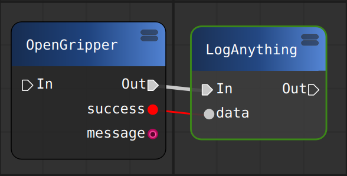
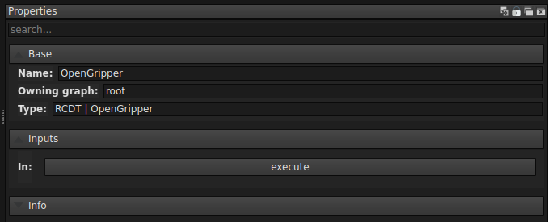

<!--
SPDX-FileCopyrightText: Alliander N. V.

SPDX-License-Identifier: Apache-2.0
-->

# PyFlow

To simplify testing and usage of the ROS package, it is possible to use PyFlow. PyFlow is a visual scripting framework for python. A [fork](https://github.com/alliander-opensource/PyFlow) of the original repository is automatically installed in the docker image.

## Start PyFlow

To use PyFlow, simply launch the application inside the docker container using:

```bash
pyflow
```

This should open the PyFlow application as shown in this image:


Some default settings are already configured for you, but you can always change them under *Edit -> Preferences*. By default, the *Additional package locations* is set to `/home/rcdt/rcdt_robotics/pyflow/packages`, so that PyFlow can find our packages.

:::{note}
If you change preference, you need to *SaveAndClose* and restart PyFlow to apply the changes.
:::

By default, 3 panels are loaded: *NodeBox*, *Properties* and *Logger*. Panels can be added under *Tools -> PyFlowBase*. For more information about PyFlow itself, please have a look at the README in the [fork](https://github.com/alliander-opensource/PyFlow).

## Create a graph

To create a graph, you can select nodes from the *NodeBox* and place them on the grid. Nodes under *PyFlowBase* are default nodes that come with PyFlow. Nodes under *RCDT* are nodes provides by us. These nodes are mainly ROS service clients and can communicate with active ROS services.

As an example, you could add the *OpenGripper* and *LogAnything* nodes. An *Out* pin one one node can be connected to an *In* pin on a second node. Data pins can only be connected if they have the same type. The data pin of the *LogAnything* node is an exception, as this pin can be connected to any data pin. Connecting the two nodes give you this simple graph:



:::{note}
You can also save and load graphs. Graphs saved to the repository can be found under `rcdt_robotics/pyflow/graphs`.
:::

## Execute a graph

You can execute a graph by selecting the first node in a sequence. This opens the properties of the selected node in the *Properties* panel:



You can now execute this node by pressing the *Execute* button. If the execution is successful, the next node in the sequence is also executed. Data is automatically passed when data pins are connected. Logs are shown in the *Logger* panel.

If you execute the graph shown above without launching ROS, the *Logger* panel shows that the service is not available and the execution of the sequence fails. If you start ROS and Franka with gripper, executing the sequence should be successful. The gripper should open and *True* should be logged by the *LogAnything* node, since *success* of the *OpenGripper* node now has the value *True*.

## Add other services

You can see all the available services under the *RCDT* group in the *NodeBox* panel. These services are defined in `rcdt_robotics/pyflow/packages/RCDT/services.py`. If you create a new service, you can add a PyFlow client node by adding the service to this file. After restarting PyFlow, this new node should be available.

### Checklist for creating a service in pyflow
- add the service under a relevant group in `rcdt_robotics/pyflow/packages/RCDT/services.py`. This ensures the service shows up in pyflow.  
```
# example entry:
add("YourService","/your_service", srv.YourService, group)
```
- add an srv file in `rcdt_messages/srv/YourService.srv`, making sure the filename is identical to the third entry in the add() function above. This defines the input and output ports on your node. Make sure to follow the convention that all these services at least return a bool success.
- Write the actual node implementation. Extend rclpy.node.Node, and call `self.create_service(srv, "/your_service",self.callback)` in the \_\_init__. `/your_service` should be identical to the entry in the first step, while the `callback()` function will contain the actual code that gets run in the pyflow node. For some examples, check `rcdt_detection/src_py`.