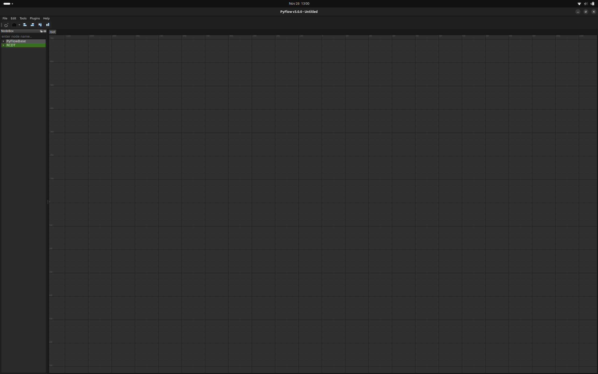

<!--
SPDX-FileCopyrightText: Alliander N. V.

SPDX-License-Identifier: Apache-2.0
-->

# PyFlow

To simplify test and usage of the ROS2 package, it is possible to use PyFlow. PyFlow is a visual scripting framework for python. A [fork](https://github.com/alliander-opensource/PyFlow) of the original repository is automatically installed in the docker image. To use PyFlow, simply launch the application inside the docker container using:

`pyflow`

This should open the PyFlow application. If you use pyflow for the first time, open the preferences using *Edit -> Preferences*. Set the *Additional package locations* to `/home/rcdt/rcdt_robotics/pyflow`, so that PyFlow can find our packages (and don't forget to click on *SaveAndClose* !):

After a restart, Pyflow should now be able to find the packages. To use the packages, add the NodeBox under *Tools -> PyFlowBase -> NodeBox*. You should be able to select from our *RCDT* package:

For more information about PyFlow itself, please have a look at the README in the fork. It is also possible to load one of the examples from the graphs directory.
